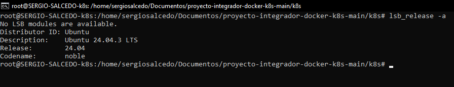
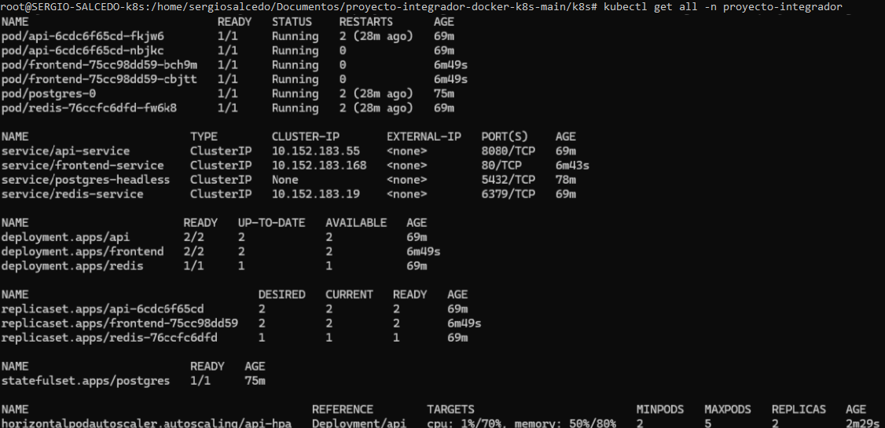
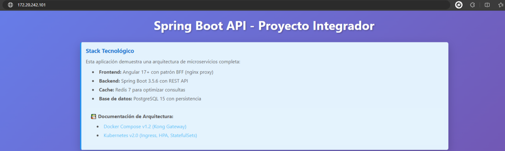
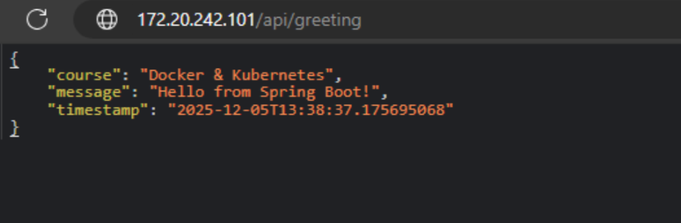
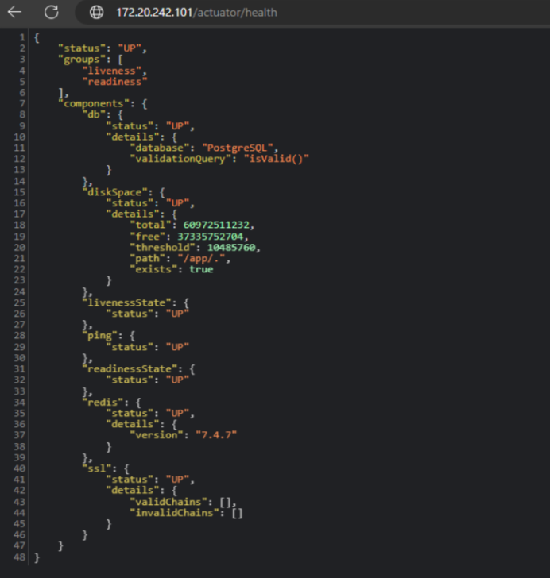

# Proyecto Final - Docker & Kubernetes

Aprendiendo el flujo profesional de actualización y gestión de aplicaciones en Kubernetes, utilizando microk8s como entorno de desarrollo local que simula un cluster cloud

**Estudiante:** SERGIO ERICK SALCEDO LEMUZ
**Curso:** [Docker & Kubernetes - i-Quattro](https://github.com/alefiengo/curso-docker-kubernetes-diaconia)

## Parte 1 Setup del Ambiente
### 1.1 Crear Máquina Virtual
```bash
lsb_release -a
```
**Screenshot:**



### 1.2 Status Microk8s
```bash
microk8s status
```
**Screenshot:**


### 1.3 Proyecto integrador
```bash
kubectl get all -n proyecto-integrador
```
**Screenshot:**



### 1.4  Navegador accediendo al frontend via IP de MetalLB
**Screenshot:**



