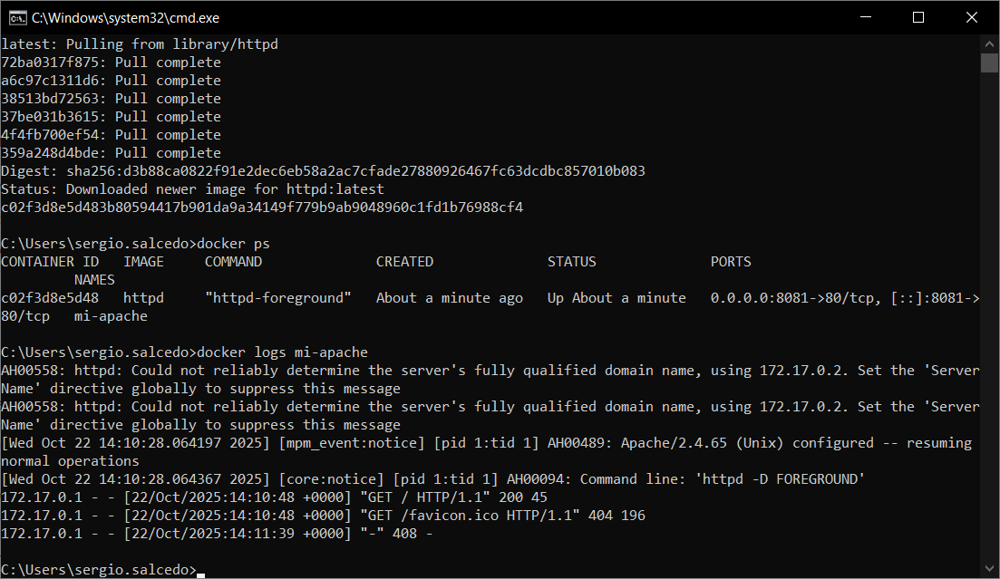

# Clase 1 - Introducción a Containers y Docker

## Objetivo

Desplegar un servidor web con HTTPD usando Docker.

## Desarrollo

### 1. Ejecutar el container

```bash
docker run -d -p 8081:80 --name mi-apache httpd
```

**Explicación:** Este comando crea y ejecuta un container con httpd en segundo plano (-d), mapeando el puerto 8081 de mi máquina al puerto 80 del container.

**Salida:**
```
c02f3d8e5d483b80594417b901da9a34149f779b9ab9048960c1fd1b76988cf4
```

**Screenshot:**


### 2. Verificar que está corriendo

```bash
docker ps
```

**Screenshot:**


### 3. Acceder desde el navegador

Accedí a `http://localhost:8081` y obtuve:


Accediendo a los logs

```bash
docker logs mi-apache
```

**Screenshot:**

Los logs generados son:



### 4. Limpieza

Deteniendo el contenedor

```bash
docker stop mi-apache
```


Eliminando el contenedor

```bash
docker rm mi-apache
```


Verificando contenedores existentes

```bash
docker ps -a
```


## Conclusiones

Aprendí a ejecutar containers en segundo plano y mapear puertos.
No tuve dificultades para aplicar los comandos.